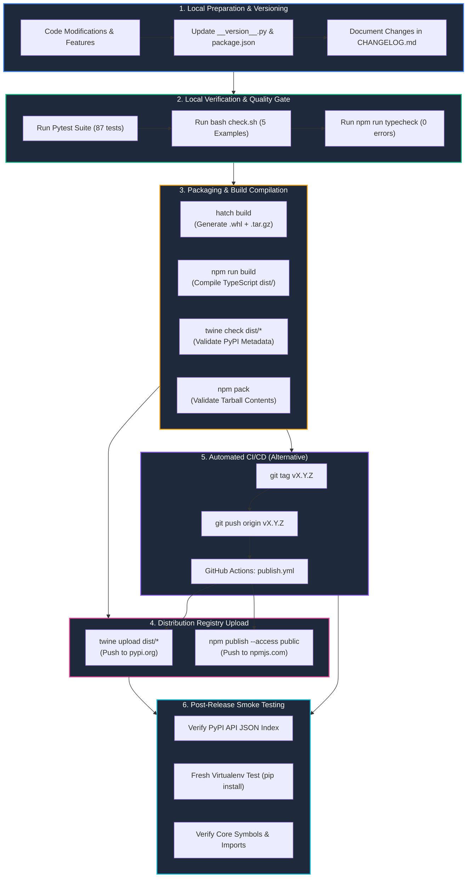
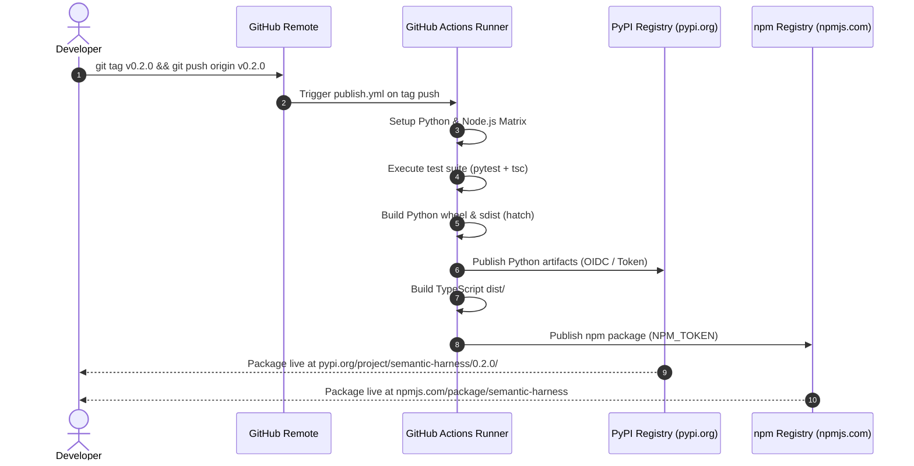

# 🚀 Semantic Harness Release & Distribution Pipeline

This document details the standard operating procedure for packaging, verifying, releasing, and distributing **Semantic Harness** across **PyPI** (Python) and **npm** (TypeScript / Node.js).

---

## 📑 Table of Contents
- [1. Visual Pipeline Architecture](#1-visual-pipeline-architecture)
- [2. Dual-Track Release Workflow](#2-dual-track-release-workflow)
- [3. Pre-Flight Verification Checklist](#3-pre-flight-verification-checklist)
- [4. Step-by-Step PyPI Distribution Procedure](#4-step-by-step-pypi-distribution-procedure)
- [5. Step-by-Step npm Distribution Procedure](#5-step-by-step-npm-distribution-procedure)
- [6. Automated GitHub Actions CI/CD Pipeline](#6-automated-github-actions-cicd-pipeline)
- [7. Post-Release Smoke Testing & Validation](#7-post-release-smoke-testing--validation)
- [8. Release Troubleshooting & Incident Management](#8-release-troubleshooting--incident-management)

---

## 1. Visual Pipeline Architecture



---

## 2. Dual-Track Release Workflow

```
┌────────────────────────────────────────────────────────────────────────────────────────────────────────┐
│                                DUAL-TRACK MONOREPO RELEASE TIMELINE                                    │
├───────────────────────────────────┬───────────────────────────────────┬────────────────────────────────┤
│           TRACK A: PYTHON         │          TRACK B: TYPESCRIPT      │         SHARED GOVERNANCE      │
├───────────────────────────────────┼───────────────────────────────────┼────────────────────────────────┤
│ 1. `python/.../__version__.py`    │ 1. `npm/package.json`             │ 1. Root `CHANGELOG.md`         │
│ 2. `pytest -v` (87 tests)         │ 2. `npm run typecheck`            │ 2. Root `README.md`            │
│ 3. `hatch build`                  │ 3. `npm run build`                │ 3. Git tag `vX.Y.Z`            │
│ 4. `twine check dist/*`           │ 4. `npm pack`                     │ 4. Git commit & push `main`    │
│ 5. `twine upload dist/*`          │ 5. `npm publish --access public`  │ 5. GitHub Release Notes        │
│ 6. Verify on PyPI                 │ 6. Verify on npmjs                │ 6. Public Documentation Sync   │
└───────────────────────────────────┴───────────────────────────────────┴────────────────────────────────┘
```

---

## 3. Pre-Flight Verification Checklist

Before releasing any version, verify all items in this checklist:

- [ ] **Semver Bump:** Version numbers match in:
  - `semantic-harness/python/semantic_harness/__version__.py`
  - `semantic-harness/python/pyproject.toml`
  - `semantic-harness/npm/package.json`
- [ ] **Changelog Updated:** New features, bug fixes, and breaking changes documented under `## [X.Y.Z] — YYYY-MM-DD` in `CHANGELOG.md`.
- [ ] **Unit Tests Passing:** `pytest -v` reports 100% pass rate.
- [ ] **System Verification Script Passing:** `bash semantic-harness/check.sh` completes with 0 exit code.
- [ ] **TypeScript Build Clean:** `npm run build` in `semantic-harness/npm` produces valid declarations in `dist/` with 0 type errors.
- [ ] **Licenses Present:** `LICENSE` file is copied to both `semantic-harness/python/LICENSE` and `semantic-harness/npm/LICENSE`.

---

## 4. Step-by-Step PyPI Distribution Procedure

### Step 1: Set Version Number
Update the single source of truth in Python:
```python
# semantic-harness/python/semantic_harness/__version__.py
__version__ = "0.2.0"
```

### Step 2: Run Verification Test Suite
```bash
cd semantic-harness
bash check.sh
```

### Step 3: Clean Previous Builds & Compile Artifacts
```bash
cd semantic-harness/python

# Remove old distribution artifacts
rm -rf dist/ build/ *.egg-info

# Build Source Distribution (.tar.gz) and Pure-Python Wheel (.whl)
hatch build
```

### Step 4: Validate Package Metadata
```bash
twine check dist/*
```
*Must return `PASSED` for all artifacts before proceeding.*

### Step 5: Upload to PyPI
```bash
twine upload dist/*
```
*(Uses credentials configured in `~/.pypirc` or prompts for `__token__` username and PyPI API key).*

---

## 5. Step-by-Step npm Distribution Procedure

### Step 1: Set Version Number in `package.json`
```json
{
  "name": "semantic-harness",
  "version": "0.2.0"
}
```

### Step 2: Compile TypeScript Code
```bash
cd semantic-harness/npm
npm run build
```

### Step 3: Test Tarball Generation
```bash
npm pack
```
*Inspect the output to ensure `dist/`, `README.md`, `package.json`, and `LICENSE` are included.*

### Step 4: Publish to npm Registry
```bash
npm publish --access public
```

---

## 6. Automated GitHub Actions CI/CD Pipeline

The repository includes [`.github/workflows/publish.yml`](file:///Users/home/Development/harness/.github/workflows/publish.yml) which automates the dual release on every git tag.



### Trigger Command:
```bash
git tag v0.2.0
git push origin v0.2.0
```

---

## 7. Post-Release Smoke Testing & Validation

### 1. Verify PyPI Registry Index
```bash
curl -s https://pypi.org/pypi/semantic-harness/json | grep -o '"version":"[^"]*"'
```

### 2. Verify Fresh Virtual Environment Installation
```bash
python3 -m venv /tmp/harness_smoke_test
source /tmp/harness_smoke_test/bin/activate

# Install from PyPI
pip install --upgrade semantic-harness

# Test Core Functionality
python3 -c "
import semantic_harness
from pydantic import BaseModel

print('✓ Loaded Semantic Harness v' + semantic_harness.__version__)

class Item(BaseModel):
    name: str

@semantic_harness.step(validates=Item, cache=True)
def run_task(x):
    return {'name': x}

res = run_task('test')
print('✓ Step validation passed:', res)
"

deactivate
rm -rf /tmp/harness_smoke_test
```

---

## 8. Release Troubleshooting & Incident Management

### Scenario 1: PyPI Rejects Upload ("File already exists")
PyPI does not allow re-uploading the same version number under any circumstances.
- **Resolution:** Bump patch version (e.g., `0.2.0` $\rightarrow$ `0.2.1`), rebuild artifacts, and upload.

### Scenario 2: Critical Bug Discovered Post-Release
Never delete a released version if other users have downloaded it.
- **PyPI Resolution:** Yank the release on PyPI dashboard (prevents new installs while not breaking existing lockfiles), then publish `0.2.1` patch immediately:
  ```bash
  # In PyPI web UI: Project > Options > Releases > Manage > Yank Release
  ```
- **npm Resolution:** Deprecate the version on npm:
  ```bash
  npm deprecate semantic-harness@0.2.0 "Critical issue; please upgrade to 0.2.1"
  ```

---

## 📊 Live Links & Registry Coordinates

- **PyPI Release:** [https://pypi.org/project/semantic-harness/0.2.0/](https://pypi.org/project/semantic-harness/0.2.0/)
- **GitHub Repository:** [https://github.com/ravii-teja/semantic-harness](https://github.com/ravii-teja/semantic-harness)
- **Research DOI:** [https://zenodo.org/records/19414309](https://zenodo.org/records/19414309)
