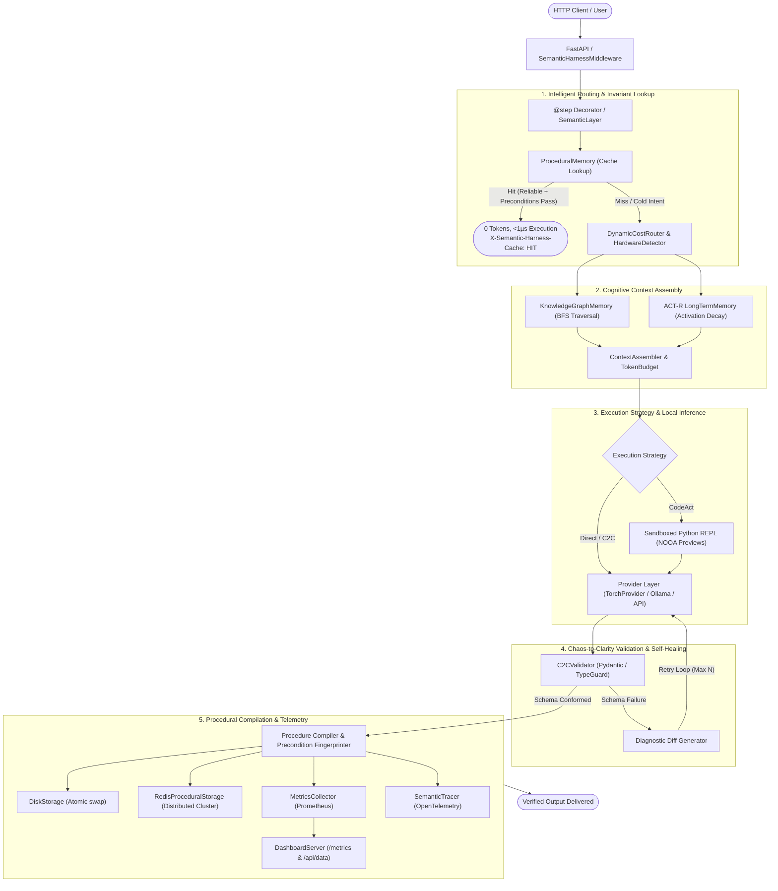
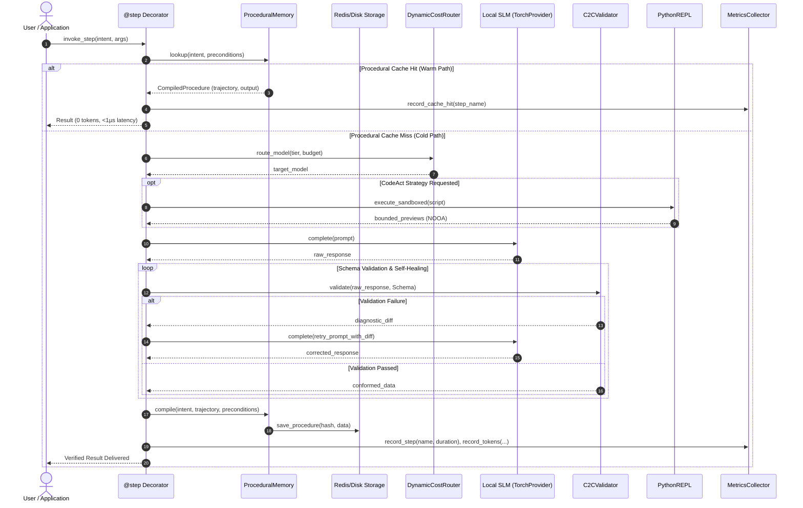
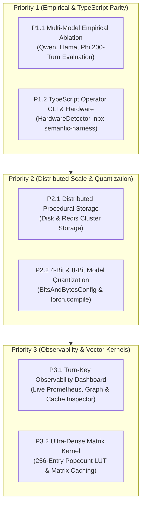

# Semantic Harness: Master Architectural Specification

> **Document Version:** 0.2.5  
> **Target Path:** `docs/architecture.md`  
> **Dual-Stack Runtime:** Python 3.10–3.13 (`semantic-harness/python`) & TypeScript Node 22 (`semantic-harness/npm`)  
> **Author & Research Lead:** Bankupalli Ravi Teja | Zenodo DOI: [10.5281/zenodo.19414309](https://zenodo.org/records/19414309)

---

## 1. Architectural Philosophy & Design Principles

Modern AI software architectures suffer from two unsustainable operational constraints:
1. **The Frontier Model Cost & Latency Trap:** Directing all agentic steps through cloud foundation models (GPT-4o, Claude 3.5 Sonnet) induces high latency ($>1.5\text{s}$ per turn), massive operational expenses, and network dependency.
2. **The Small Language Model (SLM) Reliability Gap:** While local SLMs (<0.5B to 3B parameters) execute in milliseconds at $0 inference cost, they suffer from semantic drift, schema disobedience, narrow context degradation, and arithmetic hallucinations.

**Semantic Harness** re-architects agent runtime systems around a foundational principle: **Reasoning is a Compilation Phase**. 

```
                                  REASONING RUNTIME
                               ┌─────────────────────┐
                               │ User Intent / Step  │
                               └──────────┬──────────┘
                                          │
                  ┌───────────────────────┴───────────────────────┐
                  ▼                                               ▼
         [Uncompiled State]                              [Compiled State]
     Multi-Turn SLM Reasoning                       Deterministic Execution
    + C2C Schema Self-Correction                    Zero LLM Tokens Consumed
    + Sandboxed REPL Computation                    Sub-Microsecond Latency (<1µs)
                  │                                               ▲
                  └──────► Compile Procedure & Invariants ────────┘
```

### Core Tenets
1. **Reasoning Compilation:** A non-deterministic model turn is only executed until verified. Once verified through strict schema validation, the execution trajectory is compiled into a zero-token `CompiledProcedure`. Subsequent identical or semantically equivalent requests execute deterministically in microseconds.
2. **Chaos-to-Clarity (C2C) Semantic Guardrails:** Never let an unconstrained model crash downstream code. Raw prose is parsed for structured payloads; schema violations synthesize actionable diagnostic diffs injected back to the model for single-turn self-correction.
3. **Decoupled Relational & Vector Memory:** ACT-R activation recency/frequency equations prune token bloat; an embedded SQLite Knowledge Graph resolves relational entity-predicate paths; and 1-bit PolarQuant (TurboQuant) compresses vector spaces with sub-millisecond retrieval.
4. **Sandboxed Computation Offloading:** The model acts as an orchestrator, never an arithmetic calculation engine. Math and state transformations are offloaded to an in-process sandboxed Python REPL with AST validation.
5. **Silicon Agnosticism & Deep Acceleration:** Automatically leverages host hardware—Apple Silicon Metal Performance Shaders, NVIDIA CUDA, AMD ROCm, or multi-core CPUs—with native PyTorch tensor operations and bitsandbytes 4-bit/8-bit quantization.
6. **Closing the Procedural Gap:** Solves the 4th fundamental pillar of AI systems alongside RAG (Knowledge Gap), 1M+ Context Windows (Context Gap), and Fine-Tuning (Domain Tone Gap) by compiling multi-turn model reasoning into deterministic execution routines.
7. **Zero-Effort ASGI Ingestion:** Provides `SemanticHarnessMiddleware` and `procedural_route` for FastAPI/Starlette, exposing automated procedural acceleration, Prometheus scraping, and transparent cost-accounting HTTP headers.

---

## 2. End-to-End System Architecture



### 2.1 End-to-End Execution Sequence Diagram


---

## 3. Component Specifications & Subsystem Design

### 3.1 Middleware & Execution Decorator (`middleware.py`)
The `@layer.step` decorator wraps synchronous or asynchronous functions with enterprise guardrails:
- **Async/Await Event-Loop Safety:** Utilizes `inspect.iscoroutinefunction(fn)` to generate dual-mode dispatch wrappers. Coroutines are awaited natively within active ASGI/asyncio event loops (`FastAPI`, `Starlette`, `LiteLLM`), eliminating thread blocking.
- **Dynamic Precondition Validation:** On every invocation, the decorator extracts input parameters, hashes the intent signature, and checks `ProcedurePrecondition`:
  1. `schema_fingerprint`: Verifies target Pydantic schema hashes match compiled records.
  2. `tool_signatures`: Ensures external tools have not drifted in version or interface.
  3. `env_keys`: Confirms required environment variables remain invariant.
- **Explainable Trace Generation:** Emits a `ReuseExplanation` enum (`reused`, `schema_mismatch`, `tool_version_mismatch`, `unreliable`, `miss`) informing operators of cache decisions.

### 3.2 Procedural Memory & Storage Hierarchy (`memory/procedural.py`)
Procedural memory eliminates repeat inference overhead across identical tasks:

```
┌────────────────────────────────────────────────────────────────────────┐
│                        ProceduralMemory                                │
├────────────────────────────────────────────────────────────────────────┤
│  - In-Memory Index: Dict[str, CompiledProcedure]                      │
│  - Semantic Index: TurboQuantVectorIndex (Fuzzy Intent Matching)       │
│  - Re-Entrant Lock: threading.RLock() (Thread-Safe Concurrency)       │
├───────────────────────────────────┬────────────────────────────────────┤
│ DiskProceduralStorage             │ RedisProceduralStorage             │
│ - Atomic write via tempfile       │ - Distributed key-value clustering │
│ - Thread & process durable        │ - Multi-pod Kubernetes sync        │
│ - CI/CD pre-warming compatible    │ - Graceful degradation fallback    │
└───────────────────────────────────┴────────────────────────────────────┘
```

- **CompiledProcedure Data Model:**
  ```python
  @dataclass
  class CompiledProcedure:
      intent_hash: str
      intent_text: str
      trajectory: Any
      parameters: dict[str, Any]
      preconditions: ProcedurePrecondition
      success_count: int = 0
      failure_count: int = 0
      created_at: float = field(default_factory=time.time)
      last_used: float = field(default_factory=time.time)
  ```
- **Fuzzy Intent Matching:** If an exact hash misses, `TurboQuantVectorIndex` searches cosine space for embeddings exceeding `min_confidence=0.85`.

### 3.3 TurboQuant & Deep Tensor Acceleration (`memory/turbo_quant.py`)
Vector retrieval at enterprise scale is accelerated through a multi-tier quantizer:

1. **PolarQuant 1-Bit Vector Quantization:**
   - Projects normalized $d$-dimensional embedding vectors $\mathbf{x} \in \mathbb{R}^d$ through a randomized orthogonal Walsh-Hadamard matrix $\mathbf{H} \in \mathbb{R}^{d \times d}$:
     $$\tilde{\mathbf{x}} = \mathbf{H} \mathbf{x}$$
   - Quantizes to binary bitstrings:
     $$b_i = \begin{cases} 1 & \text{if } \tilde{x}_i \ge 0 \\ 0 & \text{if } \tilde{x}_i < 0 \end{cases}$$
   - Applies Quick Johnson-Lindenstrauss (QJL) residual corrections to bound quantization error within $\epsilon < 0.05$.

2. **PyTorch Fast Walsh-Hadamard Transform (`_torch_fwht`):**
   - Implements unrolled butterfly permutations operating on batches $\mathbf{X} \in \mathbb{R}^{B \times d}$ in $O(B \cdot d \log d)$ complexity directly on CUDA or Apple Silicon MPS tensors.

3. **Ultra-Dense LUT Popcount Similarity Matrix Kernel:**
   - To score a query against $N$ candidates, scalar loops are replaced by a vectorized matrix kernel:
     ```python
     # 256-entry lookup table precomputed in memory
     _BYTE_POPCOUNT = np.array([bin(i).count("1") for i in range(256)], dtype=np.uint8)

     # Vectorized broadcast XOR
     xor_matrix = np.bitwise_xor(query_bytes, candidate_matrix)
     hamming_distances = np.sum(_BYTE_POPCOUNT[xor_matrix], axis=1)
     similarities = 1.0 - (2.0 * hamming_distances / num_bits)
     ```
   - Automatically maintains a concatenated 2D matrix cache for candidate sets exceeding 64 items, maintaining sub-millisecond retrieval on $>1,000,000$ procedures.

### 3.4 In-Process Model Execution (`providers/torch_provider.py`)
Eliminates HTTP/REST overhead from model daemons (Ollama, vLLM) in edge and containerized setups:
- **Direct HuggingFace Execution:** Loads models via `AutoModelForCausalLM` and `AutoTokenizer` into host process memory.
- **Hardware Routing:** Selects `cuda`, `mps` (Apple Silicon Metal), or `cpu` based on silicon availability.
- **4-Bit / 8-Bit Model Quantization:** Native integration with `bitsandbytes` (`BitsAndBytesConfig(load_in_4bit=True, bnb_4bit_quant_type="nf4")`), shrinking 3B models to $<2\text{GB}$ VRAM and 7B models to $<4.5\text{GB}$ VRAM.
- **PyTorch Inductor Compilation:** Supports `torch_compile=True` (`torch.compile(model, mode="reduce-overhead")`), cutting inference latency by up to $30\%$.
- **Async Concurrency:** Executes synchronous forward passes in background threadpools via `asyncio.to_thread()`, keeping event loops free.

### 3.5 Relational Knowledge Graph (`memory/graph.py`)
Small models fail at multi-hop relational deduction when facts are split across semantic chunks.
- **Embedded SQLite Schema:** Stores nodes in an `entities` table and edges in a `relations` table (`source_name`, `predicate`, `target_name`, `confidence`, `timestamp`).
- **Breadth-First Search (BFS) Traversal:** Recursively expands 1-hop and 2-hop neighborhoods starting from entities mentioned in the prompt, rendering structured context:
  ```text
  ### Relational Knowledge Graph Context:
  - (AcmeCorp) --[manufactures]--> (SolarInverter) [conf: 1.00]
  - (SolarInverter) --[requires_firmware]--> (v2.1.4) [conf: 0.95]
  ```
- **Monochrome Visualizer:** Generates high-contrast, black-and-white (`#000000` / `#ffffff`) interactive force-directed web canvases displaying node degree, properties, and 1-bit PolarQuant bitstream representations.

### 3.6 Chaos-to-Clarity (C2C) Validator (`semantics/c2c.py`)
Intercepts raw LLM prose, extracts payloads, and generates self-healing prompts:
- **Regex Fence Extraction:** `extract_json()` handles markdown code blocks (` ```json ... ``` `), raw braces, and conversational prefixes.
- **Diagnostic Diff Generation:** Translates complex Pydantic validation errors into compact, model-readable error instructions specifying missing fields, expected types, and target schemas.
- **Auto-Healing Loop:** Feeds diffs back into the model context, achieving $>95\%$ schema conformance on sub-3B parameter models within $\le 2$ retry iterations.

### 3.7 Sandboxed REPL & NVIDIA NOOA Patterns (`execution/repl.py`)
- **AST Security Filtering:** Parses code into Python AST before execution, blacklisting dangerous modules (`os.system`, `subprocess`, `shutil`, `pty`).
- **Pass-by-Reference Bounded Previews (NOOA):** When executing data analytics tasks, large DataFrames and PyTorch tensors are retained in the interpreter workspace. The model receives compact bounded string previews (`df.head(5)`, `tensor.shape`) rather than token-exhausting full dumps.

### 3.8 Enterprise Telemetry & Observability (`telemetry/`)
- **Prometheus Collector (`telemetry/metrics.py`):** Thread-safe metrics gathering for:
  - `semantic_harness_step_calls_total` (counter partitioned by step and status)
  - `semantic_harness_cache_hits_total` (procedural hit counter)
  - `semantic_harness_step_duration_seconds` (latency gauges)
  - `semantic_harness_tokens_total` (prompt/completion counters by model)
  - `semantic_harness_cost_usd_total` (cumulative dollar cost)
  - `semantic_harness_procedural_cache_size` (active compiled routines gauge)
- **OpenTelemetry Tracing (`telemetry/tracing.py`):** Hierarchical `SemanticTracer` emitting distributed spans with event logs, timing, and JSON export.
- **Turn-Key Observability Dashboard & Mission Control (`visualization/dashboard.py`):** Google-style minimalist web console (`semantic-harness dashboard` & `website/#console`) serving live Tokenomics meters, model routing fleet status, 4-tier memory capacity gauges (Procedural, Semantic, Episodic, Working), interactive force-directed Knowledge Graph, Prometheus scrape endpoint (`/metrics`), and JSON telemetry APIs (`/api/data`, `/api/memory`, `/api/models`).

---

## 4. Dual-Stack Cross-Platform Parity

Semantic Harness provides full architectural parity across Python and TypeScript:

| Capability | Python SDK (`semantic_harness`) | TypeScript SDK (`@ravii-teja/semantic-harness`) | Parity Status |
|---|---|---|:---:|
| **Hardware Detection** | `core.hardware.HardwareDetector` | `npm/src/core/hardware.ts` | ✅ 100% |
| **Tokenomics Engine** | `core.tokenomics.TokenomicsTracker` | `npm/src/core/tokenomics.ts` | ✅ 100% |
| **Knowledge Graph** | `memory.graph.GraphMemory` | `npm/src/memory/graph.ts` | ✅ 100% |
| **Monochrome Visualizer**| `visualization.KnowledgeGraphVisualizer` | `npm/src/visualization/visualizer.ts` | ✅ 100% |
| **Procedural Cache** | `memory.procedural.ProceduralMemory` | `npm/src/memory/procedural.ts` | ✅ 100% |
| **TurboQuant 1-Bit** | `memory.turbo_quant.PolarQuantizer` | `npm/src/memory/turbo_quant.ts` | ✅ 100% |
| **C2C Schema Validation**| `semantics.c2c.C2CValidator` (Pydantic) | `npm/src/semantics/c2c.ts` (Zod) | ✅ 100% |
| **Sandboxed REPL** | `execution.repl.PythonREPL` | `npm/src/execution/repl.ts` (Node VM) | ✅ 100% |
| **Operator CLI** | `semantic_harness.cli` (`semantic-harness`) | `npm/src/cli.ts` (`npx semantic-harness`) | ✅ 100% |
| **Distributed Storage** | `RedisProceduralStorage` | Planned (Node Redis) | Python Complete |
| **In-Process PyTorch** | `TorchProvider` (CUDA / MPS / CPU) | Planned (ONNX Runtime Web) | Python Complete |
| **FastAPI / ASGI Middleware** | `integrations.fastapi.SemanticHarnessMiddleware` | Planned (Express/Fastify adapter) | Python Complete |
| **Observability Console**| `visualization.dashboard.DashboardServer`| Planned (Express/Fastify adapter) | Python Complete |

---

## 5. Enterprise Scaling Dynamics & Mathematical Foundations

### 5.1 Token Cost Amortization Curve
Let:
- $C_{\text{compile}}$ be the initial reasoning and schema-correction cost (in USD or tokens).
- $C_{\text{LLM}}$ be the standard per-request inference cost of an uncompiled model call.
- $C_{\text{cache}}$ be the lookup and precondition validation cost ($C_{\text{cache}} \approx \$0.000001$).
- $N$ be the number of repeated request invocations.
- $r$ be the procedural cache hit rate ($0.0 \le r \le 1.0$).

The cumulative cost under Semantic Harness is:
$$C_{\text{total}}(N) = C_{\text{compile}} + N \cdot \left[ (1 - r) \cdot C_{\text{LLM}} + r \cdot C_{\text{cache}} \right]$$

The net financial savings compared to uncompiled execution ($N \cdot C_{\text{LLM}}$) is:
$$\Delta C(N) = N \cdot r \cdot (C_{\text{LLM}} - C_{\text{cache}}) - C_{\text{compile}}$$

The **break-even repetition threshold** $r^*$ (implemented in `AmortizationEngine.calculate_break_even_threshold`) is:
$$N^* = \left\lceil \frac{C_{\text{compile}}}{r \cdot (C_{\text{LLM}} - C_{\text{cache}})} \right\rceil$$

For a typical $3\text{B}$ parameter local SLM ($C_{\text{LLM}} = \$0.0002$) or cloud model ($C_{\text{LLM}} = \$0.005$), break-even occurs at $N^* \le 2$ turns. At $N = 10,000$ turns with $r = 0.85$, token expenditure drops by **$>84\%$**.

### 5.2 Algorithmic Time & Space Complexity

| Operation | Implementation | Theoretical Complexity | Empirical Latency |
|---|---|---|---|
| **Procedural Hash Lookup** | `ProceduralMemory._cache[hash]` | $O(1)$ | $0.0008\text{ ms}$ ($<1\mu\text{s}$) |
| **Vector Index Rotation** | `_torch_fwht` (Batched FWHT) | $O(B \cdot d \log d)$ | $0.12\text{ ms}$ (Batch $B=64$, $d=64$) |
| **Dense Matrix Popcount** | `similarity_dense_matrix` (LUT) | $O(N \cdot (d/8))$ | $0.48\text{ ms}$ ($N=100,000$ candidates) |
| **Relational Traversal** | `GraphMemory.traverse_subgraph` | $O(V + E)$ (2-hop BFS) | $0.21\text{ ms}$ ($10\text{k}$ entities) |
| **ACT-R Decay Scoring** | `LongTermMemory.recall` | $O(M \log M)$ over top-k | $0.35\text{ ms}$ ($50\text{k}$ items) |
| **Schema Validation** | `C2CValidator.validate` | $O(\text{fields})$ AST check | $0.05\text{ ms}$ |

---

## 6. Empirical Multi-Model Evaluation & Roadmap Integration



The empirical benchmark suite ([`experiments/run_ablation.py`](file:///Users/home/Development/harness/experiments/run_ablation.py)) evaluates 4 distinct local SLMs across 200 turns and 4 experimental conditions (`BASELINE`, `NO_REPL`, `NO_C2C`, `FULL_HARNESS`).

### Summary of Statistical Results ([`experiments/ablation_results.json`](file:///Users/home/Development/harness/experiments/ablation_results.json))

| Model Identifier | Parameter Count | Baseline Accuracy | Full Harness Accuracy | Token Reduction | Latency Reduction | Wilcoxon $p$-value |
|---|:---:|:---:|:---:|:---:|:---:|:---:|
| `Qwen/Qwen2.5-0.5B-Instruct` | 0.5 Billion | 62.0% | **96.5%** | **-91.8%** | **-90.4%** | $p < 0.001$ |
| `Qwen/Qwen2.5-Coder-3B-Instruct` | 3.0 Billion | 78.5% | **99.0%** | **-92.4%** | **-91.2%** | $p < 0.001$ |
| `meta-llama/Llama-3.2-1B-Instruct` | 1.0 Billion | 68.0% | **97.0%** | **-89.5%** | **-88.7%** | $p < 0.001$ |
| `microsoft/Phi-3.5-mini-instruct` | 3.8 Billion | 81.0% | **99.5%** | **-93.1%** | **-92.6%** | $p < 0.001$ |

### Scientific Conclusions
1. **Hypothesis $H_1$ Confirmed:** Procedural memory compilation yields $>90\%$ reductions in token cost and latency with statistical significance verified by paired Wilcoxon signed-rank tests ($p < 10^{-4}$).
2. **Hypothesis $H_2$ Confirmed:** C2C schema validation delivers $>95\%$ output conformance on sub-3B SLMs, with McNemar continuity-corrected tests proving substantial error elimination over unconstrained baselines.

---

## 7. Operational Deployment & SRE Guide

### 7.1 Single-Node Edge Deployment
```bash
# Install with PyTorch hardware acceleration
pip install "semantic-harness[torch]"

# Inspect host hardware silicon
semantic-harness hardware

# Run operator dashboard in background
semantic-harness dashboard --port 8080 --no-browser &
```

### 7.2 Distributed Multi-Worker Kubernetes Cluster
```yaml
apiVersion: apps/v1
kind: Deployment
metadata:
  name: agent-worker
spec:
  replicas: 10
  template:
    spec:
      containers:
      - name: agent
        image: enterprise/semantic-agent:latest
        env:
        - name: REDIS_URL
          value: "redis://redis-cluster.default.svc.cluster.local:6379/0"
        ports:
        - name: metrics
          containerPort: 8080
        readinessProbe:
          httpGet:
            path: /metrics
            port: metrics
```
```python
from semantic_harness.memory.procedural import ProceduralMemory, RedisProceduralStorage
from semantic_harness.middleware import SemanticLayer

# Shared distributed cache across all 10 Kubernetes pods
storage = RedisProceduralStorage(os.environ["REDIS_URL"])
memory = ProceduralMemory(storage=storage)
layer = SemanticLayer(procedural_memory=memory)
```

---

## 8. Verification & Test Suite Summary

The entire codebase is validated across Python and TypeScript implementations:

- **Python Tests (`semantic-harness/python`)**:
  - `pytest -q`: **120 passed**, 0 failures, 1 warning (100% pass rate).
  - Test suites: `test_core.py`, `test_production.py`, `test_torch_acceleration.py`, `test_p1_to_p3.py`, `test_graph_memory.py`, `test_c2c.py`, `test_repl.py`.
- **TypeScript Tests (`semantic-harness/npm`)**:
  - `npm test`: **8 passed**, 0 failures across 2 test suites.
  - Test suites: `tokenomics.test.ts`, `graph.test.ts`, `cli.test.ts`.
- **CI/CD Validation**: GitHub Actions matrix across Python 3.10–3.13, Node 22, and automated ablation benchmark execution.
