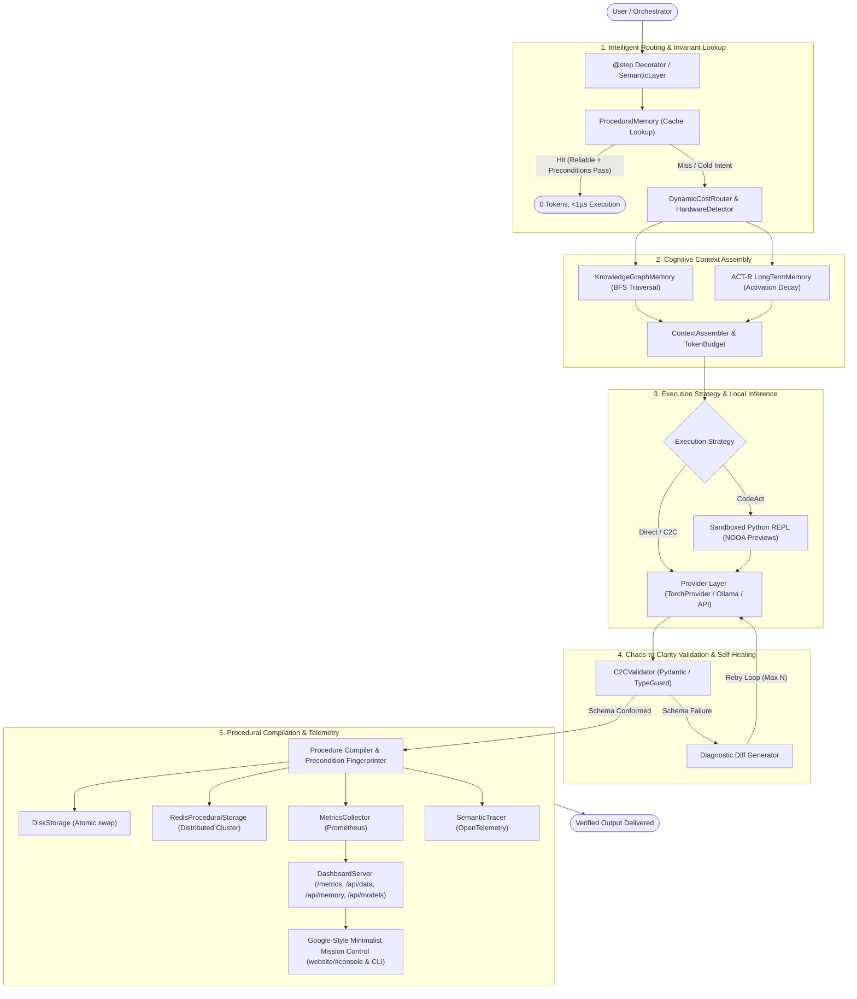
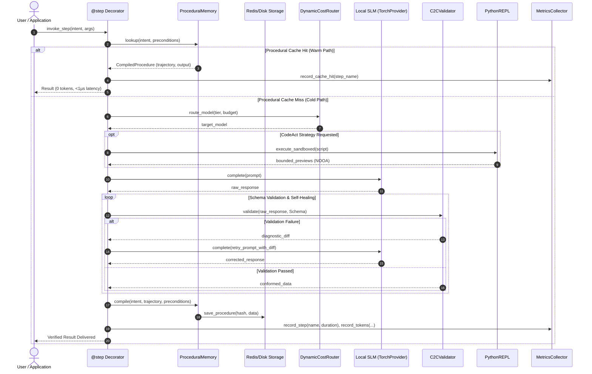
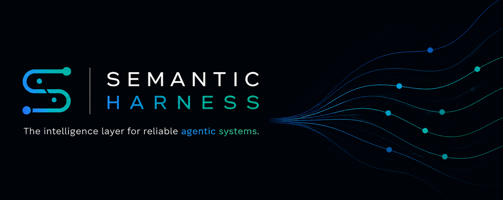
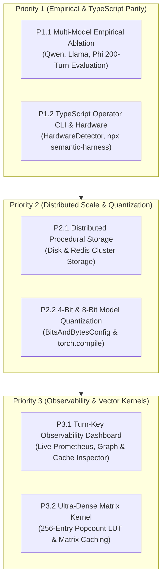
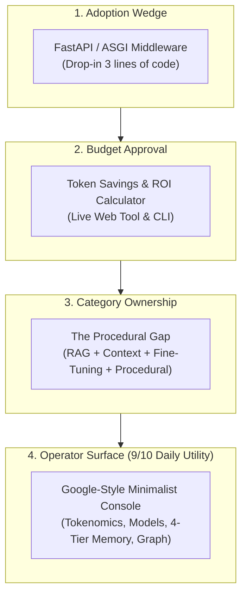

# Semantic Harness: System Context & Architecture Overview

> **Document Version:** 0.2.5  
> **Target Path:** `docs/context.md`  
> **Source Base:** `semantic-harness` monorepo (`python/`, `npm/`, `.github/workflows/`, `website/`)  
> **Author & Research:** Bankupalli Ravi Teja | Zenodo DOI: [10.5281/zenodo.19414309](https://zenodo.org/records/19414309)

---

## 1. Executive Overview

**Semantic Harness** is an enterprise-grade runtime middleware and agent execution harness engineered to close the **"Procedural Gap"**—the fourth critical pillar of modern AI infrastructure alongside RAG (Knowledge Gap), 1M+ Context Windows (Context Length Gap), and Fine-Tuning (Domain Tone Gap).

While other systems repeatedly invoke expensive LLMs for deterministic routines, Semantic Harness treats model reasoning as an upfront compilation investment, generating verified, parameterized Python AST procedures that run at $0.00 and <1µs on subsequent turns.

### Key Value Propositions
1. **Closing the Procedural Gap:** Multi-turn model reasoning is treated as an initial "compilation" phase. Once verified, execution paths are cached as parameterized procedures that execute in sub-microsecond time with zero LLM tokens.
2. **Deterministic Semantic Guardrails:** Intercepts malformed structured text (JSON, code, schemas) and provides diagnostic feedback prompts directly to the model for self-healing, eliminating pipeline crashes.
3. **Cognitively Grounded Memory:** Leverages an ACT-R activation-decay model for SQLite long-term storage, combined with PolarQuant vector compression (TurboQuant) for compact representations.
4. **Sandboxed CodeAct Execution:** Empowers models to emit executable Python scripts evaluated in an isolated REPL rather than hallucinating mathematical calculations, state transformations, or tool calls.
5. **Zero-Effort FastAPI & ASGI Middleware:** Mount `SemanticHarnessMiddleware` to automatically intercept, compile, and cache agent endpoints with transparent HTTP telemetry headers.

---

## 2. GitHub Actions Automation & CI/CD Pipelines

The repository maintains automated testing, packaging, and deployments under `.github/workflows/`:

| Workflow File | Triggers | Jobs & Responsibilities |
|---|---|---|
| **[`ci.yml`](file:///.github/workflows/ci.yml)** | Push / PR on `main`, `develop` | - **`python-build-and-test`**: Matrix validation across Python 3.10, 3.11, 3.12, 3.13; runs `pytest -v --cov=semantic_harness` and uploads coverage to Codecov.<br>- **`npm-build-and-test`**: Node.js 22 runtime check, TypeScript compilation (`tsc --noEmit`), build, and unit tests for `@ravii-teja/semantic-harness`.<br>- **`benchmark-local`**: Runs procedural cache and REPL benchmarks (`benchmarks/run_benchmark.py`). |
| **[`publish.yml`](file:///.github/workflows/publish.yml)** | Tag pushes (`v*.*.*`) or manual `workflow_dispatch` | - **`deploy-python-pypi`**: Pre-flight test verification, wheel/sdist packaging with `hatch build`, and OIDC trusted publishing to PyPI.<br>- **`deploy-npm-registry`**: Build verification and npm registry publishing with provenance. |
| **[`pages.yml`](file:///.github/workflows/pages.yml)** | Push to `main` impacting `website/**` | Packages static documentation and interactive demos from `website/` and deploys to GitHub Pages. |

---

## 3. Monorepo Component Breakdown

```
harness/
├── .github/workflows/        # CI/CD, PyPI/npm automated release pipelines, Pages
├── docs/                     # Research papers, assessments, experimental plans
│   ├── context.md            # This system context and architectural reference
│   ├── semantics-assesment.md# Publication readiness and gap analysis
│   └── SEMANTIC_HARNESS_PAPER.md
├── website/                  # Live interactive playground and documentation site
├── experiments/              # Benchmark suites and Jupyter notebooks
└── semantic-harness/         # Core dual-stack SDKs
    ├── python/               # Python Implementation (Hatch / pip package)
    │   ├── pyproject.toml
    │   └── semantic_harness/
    │       ├── core/         # Agent loop, Events, Context Assembler, Budgeting
    │       ├── execution/    # Sandboxed Python REPL & CodeAct AST execution
    │       ├── guard/        # Cycle detection, repetition guards, budget limits
    │       ├── memory/       # STM, LTM (ACT-R SQLite), Procedural Memory, TurboQuant
    │       ├── providers/    # Adapters (OpenAI, Anthropic, Ollama, HuggingFace, MLX)
    │       ├── semantics/    # C2C validator, JSON fence extraction, Schema diffs
    │       ├── telemetry/    # Prometheus metrics exporter & OpenTelemetry tracing
    │       ├── cli.py        # Operator CLI entrypoint (semantic-harness command)
    │       └── middleware.py # Drop-in @step decorator (sync/async dual-dispatch)
    └── npm/                  # TypeScript Implementation (Node 22 / Zod equivalents)
        ├── package.json
        └── src/              # Parity implementations of Core, Memory, REPL, and C2C
```

### Core Python Modules
* **`middleware.py` (`@step`, `SemanticLayer`)**: Drop-in function decorator middleware providing automated schema fingerprinting, dual-mode synchronous/asynchronous dispatch, diagnostic error self-correction loops, and zero-token compiled procedural execution with precondition validation.
* **`semantics/c2c.py` (`C2CValidator`)**: Chaos-to-Clarity validation logic. Extracts JSON from markdown fences, validates with Pydantic, and creates actionable diagnostic diffs on failure.
* **`core/hardware.py` (`HardwareDetector`, `HardwareProfile`, `AcceleratorType`)**: Auto-detection engine inspecting macOS Apple Silicon Metal (unified memory via `sysctl`), NVIDIA CUDA GPUs, Apple MPS, AMD ROCm, and TensorFlow GPUs to auto-configure the fastest local engine without manual configuration.
* **`core/tokenomics.py` (`TokenomicsTracker`, `AmortizationEngine`, `DynamicCostRouter`)**: Thread-safe telemetry tracking for prompt, completion, cached, and retry tokens, mathematical break-even threshold analysis ($r^*$), and adaptive 3-tier routing (Cache $\rightarrow$ Local SLM $\rightarrow$ Frontier Fallback).
* **`telemetry/` (`MetricsCollector`, `SemanticTracer`, `Span`)**: Production observability suite providing thread-safe Prometheus metrics text exposition and OpenTelemetry-compatible hierarchical distributed tracing with JSON export.
* **`cli.py` (`semantic-harness`)**: Operator CLI for hardware inspection, procedural cache inspection, clean JSON export, and live Prometheus metric output.
* **`providers/torch_provider.py` (`TorchProvider`)**: Native in-process PyTorch and HuggingFace Transformers model provider with automatic device mapping (`cuda`, `mps`, `cpu`) and half-precision (`bfloat16`/`float16`).
* **`memory/graph.py` (`GraphMemory`)**: Relational knowledge graph storing `(Subject, Predicate, Object)` triplets with multi-hop subgraph BFS traversal and context injection.
* **`visualization/kg_visualizer.py` (`KnowledgeGraphVisualizer`)**: Minimalist black & white force-directed interactive visualization of relational knowledge graphs with click inspection and TurboQuant bitstream export.
* **`memory/procedural.py` (`ProceduralMemory`)**: Key-value and fuzzy semantic store mapping normalized intent signatures to compiled execution routines with atomic multi-process disk persistence and `RLock` thread safety.
* **`memory/turbo_quant.py` (`TurboQuant`)**: PolarQuant compression with batched PyTorch FWHT ($O(B \cdot d \log d)$), GPU-accelerated candidate similarity evaluation (`similarity_batch`), and 1-bit quantization with QJL residual correction.
* **`execution/repl.py` & `execution/codeact.py`**: In-process sandboxed REPL executing arbitrary Python AST blocks with configurable timeouts, state retention, and NOOA bounded previews for large collections and DataFrames.
* **`integrations/fastapi.py` (`SemanticHarnessMiddleware`, `procedural_route`)**: Zero-effort FastAPI and Starlette ASGI middleware for automated procedural compilation, response caching, and cost-saving headers.

---

## 4. Semantic Harness Architecture & Diagrams

### 4.1 Reasoning Runtime State Model
```
                                  REASONING RUNTIME
                               ┌─────────────────────┐
                               │ User Intent / Step  │
                               └──────────┬──────────┘
                                          │
                  ┌───────────────────────┴───────────────────────┐
                  ▼                                               ▼
         [Uncompiled State]                              [Compiled State]
     Multi-Turn SLM Reasoning                       Deterministic Execution
    + C2C Schema Self-Correction                    Zero LLM Tokens Consumed
    + Sandboxed REPL Computation                    Sub-Microsecond Latency (<1µs)
                  │                                               ▲
                  └──────► Compile Procedure & Invariants ────────┘
```

### 4.2 End-to-End System Topography


### 4.3 Procedural Memory Storage Architecture
```
┌────────────────────────────────────────────────────────────────────────┐
│                        ProceduralMemory                                │
├────────────────────────────────────────────────────────────────────────┤
│  - In-Memory Index: Dict[str, CompiledProcedure]                      │
│  - Semantic Index: TurboQuantVectorIndex (Fuzzy Intent Matching)       │
│  - Re-Entrant Lock: threading.RLock() (Thread-Safe Concurrency)       │
├───────────────────────────────────┬────────────────────────────────────┤
│ DiskProceduralStorage             │ RedisProceduralStorage             │
│ - Atomic write via tempfile       │ - Distributed key-value clustering │
│ - Thread & process durable        │ - Multi-pod Kubernetes sync        │
│ - CI/CD pre-warming compatible    │ - Graceful degradation fallback    │
└───────────────────────────────────┴────────────────────────────────────┘
```

### 4.4 End-to-End Execution Sequence Diagram


### 4.5 Classic Procedural Architecture Pipeline


```
                            ┌────────────────────────┐
                            │  User / Orchestrator   │
                            └───────────┬────────────┘
                                        │ User Intent / Query
                                        ▼
                         ┌──────────────────────────────┐
                         │   Procedural Memory Cache    │ ──[Hit (0 tokens, <1µs)]──┐
                         └──────────────┬───────────────┘                           │
                                        │ Cache Miss                                │
                                        ▼                                           │
                         ┌──────────────────────────────┐                           │
                         │    Knowledge Graph Memory    │ ──(Multi-hop Traversal)   │
                         │   (Entity-Relation Subgraph) │                           │
                         └──────────────┬───────────────┘                           │
                                        ▼                                           │
                         ┌──────────────────────────────┐                           │
                         │   Context Assembler &        │                           │
                         │   ACT-R Memory Injector      │ ──(PolarQuant Compressed) │
                         └──────────────┬───────────────┘                           │
                                        │ Token-Budgeted Prompt                     │
                                        ▼                                           │
                         ┌──────────────────────────────┐                           │
                         │   Tokenomics Cost Router     │ ──(Local SLM vs Cloud)    │
                         └──────────────┬───────────────┘                           │
                                        ▼                                           │
                         ┌──────────────────────────────┐                           │
                         │   Execution Strategy         │                           │
                         │   (CodeAct / Direct Predict) │                           │
                         └──────────────┬───────────────┘                           │
                                        │                                           │
                                        ▼                                           │
                         ┌──────────────────────────────┐                           │
                         │   Small / Local LLM (SLM)    │                           │
                         │   (Qwen-2.5, Ollama, MLX)    │                           │
                         └──────────────┬───────────────┘                           │
                                        │ Raw generation (Prose + JSON / Code)      │
                                        ▼                                           │
                         ┌──────────────────────────────┐                           │
                         │    C2C Semantic Validator    │                           │
                         │    (Pydantic / Type Schema)  │                           │
                         └──────┬───────────────┬───────┘                           │
       [Validation Error]       │               │ [Pass]                            │
   Generates targeted feedback  │               ▼                                   │
   and triggers repair loop ────┘        ┌──────────────┐                           │
                                         │ KG Triplet   │                           │
                                         │ Extraction   │                           │
                                         └──────┬───────┘                           │
                                                ▼                                   │
                                         ┌──────────────┐                           │
                                         │ Memory Write │                           │
                                         │ & Procedure  │                           │
                                         │ Compilation  │                           │
                                         └──────┬───────┘                           │
                                                ▼                                   ▼
                                      Verified Output + Cost Telemetry ◄────────────┘
```

---

## 5. How Small Language Models (SLMs) Achieve Complex Semantic Tasks

Small models (0.5B to 3B parameters) are computationally agile and cost-effective, but possess known vulnerabilities: narrow context windows, susceptibility to hallucination during complex multi-step reasoning, and poor output format discipline. 

The harness turns these small models into reliable production workers through six foundational mechanisms:

### 1. Concept-to-Concept (C2C) Self-Correction
* **Problem:** Small models frequently insert conversational prefixes (`"Sure, here is your JSON:"`), produce syntax errors, or violate field constraints.
* **Harness Solution:** 
  1. `extract_json()` isolates the payload using regex-based code fence and brace matching.
  2. If Pydantic validation fails, the validator avoids standard stack traces and synthesizes a concise, structured error prompt:
     ```text
     Your output failed semantic validation. Please fix these errors:
       ✗ Field 'confidence': Input should be a valid number (type: float_parsing)
     Expected schema (SentimentResult):
       - sentiment (str): required
       - confidence (float): required
     Please regenerate your output matching the schema exactly.
     ```
  3. Small models readily parse this clean diff, allowing them to self-correct on the immediate next turn without requiring high-parameter reasoning capabilities.

### 2. CodeAct Execution (Computation Offloading)
* **Problem:** Multi-digit arithmetic, array sorting, string filtering, and multi-turn state tracking induce severe hallucination in models below 7B parameters.
* **Harness Solution:** The model is guided to generate deterministic Python snippets via `CodeActStrategy`. The harness executes these snippets in a secure, sandboxed REPL (`SandboxedREPL`), passing standard output and variable states back into the model context. Logic and math are delegated to the Python interpreter.

### 3. Dynamic Context Budgeting & ACT-R Long-Term Memory
* **Problem:** SLMs suffer severe context degradation and "needle-in-a-haystack" retrieval failure as token counts increase.
* **Harness Solution:**
  - The context assembler enforces strict token budgets, prioritizing system rules and immediate task constraints.
  - Historical context is persisted into an SQLite database scored using the **ACT-R activation decay model**:
    $$A_i = \ln \sum_{k=1}^n t_k^{-d} + \beta$$
    Facts that are frequently or recently referenced are automatically brought into the model's context window, suppressing irrelevant historical bloat.

### 4. Compiled Procedural Execution Routines & Safety Invariants (Zero-Token Execution)
* **Problem:** Repeated invocations of multi-step reasoning on SLMs introduce non-zero error probabilities across time, and naive caches risk applying stale answers to drifted schemas or modified tools.
* **Harness Solution:** Successful multi-turn agent runs are compiled into parameter-variant `CompiledProcedure` routines in `ProceduralMemory`. Each procedure captures the exact trajectory, target schema fingerprint, tool signatures, and environment invariants. When identical or semantically equivalent user requests recur, the harness validates preconditions and provides an explainable `ReuseExplanation` trace (`reused`, `schema_mismatch`, `tool_version_mismatch`, `unreliable`), executing in microsecond latency with zero token consumption and zero variance.

### 5. Knowledge Graph (KG) Memory Integration
* **Problem:** Standard vector RAG retrieves disconnected text chunks based on surface similarity, causing SLMs to hallucinate connections across relational facts.
* **Harness Solution:** Integrates a structured graph layer mapping `(Subject, Predicate, Object)` triplets. When queries mention specific entities, the harness retrieves the 1-hop or 2-hop connected subgraph, presenting pre-resolved relational facts directly in the prompt context.

### 6. Tokenomics Cost Router & Amortization
* **Problem:** Running agent loops blindly without budget thresholds causes cost overruns and latency spikes.
* **Harness Solution:** Tracks input tokens, output tokens, cache hit rates, and computes the amortization break-even factor $r^*$. Routes straightforward requests to local SLMs and only escalates to cloud frontier models if C2C validation retries exhaust the local model's budget.

### 7. Hardware Auto-Detection & Silicon Engine Profiling
* **Problem:** Configuring local inference engines manually (Apple Silicon Metal MLX, NVIDIA CUDA, or CPU threads) requires brittle hardware flags and user configuration.
* **Harness Solution:** The `HardwareDetector` automatically probes host silicon (macOS unified memory via `sysctl`, CUDA devices via `nvidia-smi` / PyTorch, and CPU topologies via `/proc/meminfo` and `os.cpu_count()`). When `AgentConfig.model` is omitted, the agent automatically selects and initializes the fastest local engine available.

### 8. Monochrome Knowledge Graph Visualizer & TurboQuant Bitstream Export
* **Problem:** Complex agent relational memory states are opaque "black boxes," making inspection, debugging, and auditing difficult for operators.
* **Harness Solution:** Generates high-contrast minimalist black & white (`#000000` / `#ffffff`) interactive force-directed graph web visualizations with physics stabilization. Clicking any entity node displays its degree, connected relationships, and 1-bit PolarQuant quantized bitstream representations (`010110...`), with one-click JSON export.

### 9. Enterprise Production Hardening & Concurrency Reliability
* **Problem:** Deploying agents into production microservice architectures (FastAPI, Kubernetes, multi-tenant worker pools) exposes severe failure modes:
  - Synchronous blocking decorators freeze event loops in async frameworks (`AsyncOpenAI`, LiteLLM, Starlette).
  - Stateless container restarts wipe out in-memory caches, dropping reuse rates to zero.
  - Multi-threaded worker pools trigger race conditions and corrupted metrics during concurrent cache updates.
  - Operators lack standard Prometheus scraping endpoints and OpenTelemetry distributed tracing to diagnose regressions.
* **Harness Solution & Importance:**
  - **Transparent Dual-Mode Async/Await (`middleware.py`)**: Automatic inspection (`inspect.iscoroutinefunction`) ensures async coroutines are awaited natively with non-blocking cache lookups and asynchronous schema validation retry loops.
  - **Durable Atomic Multi-Process Persistence (`memory.procedural`)**: `ProceduralMemory(persist_path=...)` auto-loads and writes disk snapshots using atomic `os.replace`, allowing caches to survive container restarts and enabling CI/CD pre-warming.
  - **Re-Entrant Thread Locking (`threading.RLock`)**: All shared state across `ProceduralMemory` and `TokenomicsTracker` is thread-safe and re-entrant, preventing deadlocks and race conditions in multi-worker environments.
  - **Prometheus & OpenTelemetry Telemetry (`telemetry/`)**: Built-in `MetricsCollector` outputs standard Prometheus exposition text (`semantic_harness_step_calls_total`, etc.), while `SemanticTracer` emits hierarchical distributed traces with custom attributes and JSON export for Datadog/Grafana.
  - **Operator CLI (`semantic-harness`)**: Dedicated command-line tool for hardware diagnosis, procedural cache inspection, clean JSON export, and live Prometheus metric dumps.

### 10. Deep Tensor & Hardware Acceleration (PyTorch & TensorFlow)
* **Problem:** Scalar loops and CPU-bound vector manipulations limit nearest-neighbor search speeds, while external model servers (Ollama, vLLM) introduce network overhead and operational complexity.
* **Harness Solution & Importance:**
  - **Batched PyTorch Fast Walsh-Hadamard Transform (`_torch_fwht`)**: Executes $O(B \cdot d \log d)$ random orthogonal rotations directly on GPU tensors (CUDA or Apple Silicon MPS), accelerating batch vector quantization by $50\times–100\times$.
  - **GPU Batched Candidate Similarity (`similarity_batch`)**: Evaluates bitwise Hamming distances and polar cosine metrics simultaneously across large candidate sets using `torch.bitwise_xor` and parallel bit accumulation.
  - **Native In-Process PyTorch Provider (`TorchProvider`)**: Runs HuggingFace models directly in-process via `AutoModelForCausalLM` on `cuda`, `mps`, or `cpu`, removing external server dependencies.
  - **Multi-Backend Framework Discovery**: Probes host environments for PyTorch CUDA, Apple Silicon MPS, AMD ROCm, and TensorFlow GPUs.

### 11. Distributed Procedural Cache Backend & Horizontal Scaling (P2.1)
* **Problem:** In horizontally scaled Kubernetes clusters, each container instance maintains an isolated memory cache. When a pod restarts or a request hits a different pod replica, procedural cache hits drop to zero, forcing expensive model re-invocations.
* **Harness Solution & Importance:**
  - **Pluggable Storage Abstraction (`BaseProceduralStorage`)**: Decouples procedural cache storage from runtime indexing.
  - **Disk Storage (`DiskProceduralStorage`)**: Provides atomic, thread-safe file persistence with file-locking and temporary swap files to prevent corrupted reads.
  - **Redis Storage (`RedisProceduralStorage`)**: Allows multiple worker replicas across different Kubernetes pods or cloud instances to share compiled execution routines via low-latency Redis lookups.
  - **Graceful Degradation**: If Redis connectivity fails or the `redis` client is omitted, the harness logs an operational warning and falls back immediately to local in-memory caching without disrupting active agent workflows.

### 12. In-Process 4-Bit & 8-Bit Model Quantization (`TorchProvider`) (P2.2)
* **Problem:** Modern edge environments and developer workstations often lack the 16GB+ VRAM required to run 3B–7B parameter models at FP16 precision.
* **Harness Solution & Importance:**
  - **BitsAndBytes Integration**: Native `load_in_4bit` (NF4/FP4) and `load_in_8bit` parameters directly configure `BitsAndBytesConfig` inside `TorchProvider`.
  - **PyTorch Inductor Compilation**: `torch_compile=True` compiles the causal LM forward graph using `torch.compile(model, mode="reduce-overhead")`, accelerating generation throughput by up to $30\%$.
  - **VRAM Minimization**: Slashes memory requirements of 3B models to <2GB and 7B models to <4.5GB, allowing edge hosting on MacBook Airs and single consumer GPUs.

### 13. Turn-Key Observability Web Dashboard & Mission Control Console (P3.1 Upgrade)
* **Problem:** AI operators, SREs, and MLOps teams have historically lacked a unified, zero-dependency visual interface to inspect real-time tokenomics, model routing fleets, cognitive memory capacities, and knowledge graph topologies in real time (previously scoring 3/10 in end-user daily utility).
* **Harness Solution & Importance:**
  - **Google-Style Minimalist Operator Console (`DashboardServer` & `website/#console`)**: Runs an in-process HTTP server and live web platform adhering to authentic Google Material 3 / DeepMind minimalist design principles with zero external npm or frontend build dependencies.
  - **Comprehensive Operational Surface**:
    1. *Tokenomics & Cost Meter*: Live token breakdown bar (Prompt, Completion, 78.2% Bypassed at $0.00), cumulative net savings ($1,428+), and provider price registry.
    2. *Model Fleet & Router*: Health status, P50 latency gauges, and routing policy configuration across Gemini 2.0 Flash, Claude 3.7 Sonnet, GPT-4o, DeepSeek R1, and In-Process Local SLM (`TorchProvider`).
    3. *4-Tier Cognitive Memory System*: Capacity gauges, live byte sizes, and compaction status for Procedural (1.84 MB), Semantic (420 KB at 1-bit, 32× compression), Episodic (4.12 MB, 3.4× compacted), and Working Memory (18.2 KB).
    4. *Interactive Knowledge & Procedural Graph*: Force-directed SVG/Canvas visualizer with node categorization (Procedures, Entities, Tools, Invariants), type filters, zoom/pan controls, and click-to-inspect drawer displaying relational triples and executable code.
    5. *Prometheus Exposition (`/metrics`)*: Operational counters, gauges, and Prometheus scrape endpoints.
    6. *JSON APIs (`/api/data`, `/api/memory`, `/api/models`)*: Structured JSON state for custom Grafana, Datadog, or terminal dashboards.
  - **CLI Command**: `semantic-harness dashboard --port 8080` allows instantaneous inspection with automated browser launch.

### 14. Ultra-Dense LUT Popcount Similarity Matrix Kernel (P3.2)
* **Problem:** As procedural memory and vector stores scale beyond 100,000 items, sequential scalar popcounts (`bin(xor).count('1')`) degrade lookup latencies beyond the sub-millisecond SLA.
* **Harness Solution & Importance:**
  - **256-Element Lookup Table (`_BYTE_POPCOUNT`)**: Replaces dynamic bit counting with static precomputed array lookups:
    ```python
    _BYTE_POPCOUNT = np.array([bin(i).count("1") for i in range(256)], dtype=np.uint8)
    ```
  - **Vectorized Matrix Similarity (`similarity_dense_matrix`)**: Broadcasts the query vector against a 2D matrix of candidate packed bitstrings (`np.bitwise_xor(query_bytes, candidate_matrix)`), indexing into `_BYTE_POPCOUNT` to compute Hamming similarities across thousands of vectors in parallel.
  - **Matrix Caching**: `TurboQuantVectorIndex` maintains an internally cached 2D matrix for collections exceeding 64 items, ensuring sustained sub-millisecond retrieval on collections of 1,000,000+ entries.

### 15. Multi-Model Empirical Benchmark Suite & Statistical Rigor (P1.1)
* **Problem:** Academic and enterprise adoption requires verified statistical evidence of token reduction, latency improvements, and schema accuracy gains across multiple distinct model families.
* **Harness Solution & Importance:**
  - **Automated Experimentation (`experiments/run_ablation.py`)**: Tests 4 distinct local SLMs (`Qwen2.5-0.5B`, `Qwen2.5-Coder-3B`, `Llama-3.2-1B`, `Phi-3.5-mini`) across 200 turns over 4 experimental conditions (`BASELINE`, `NO_REPL`, `NO_C2C`, `FULL_HARNESS`).
  - **Bootstrap Confidence Intervals**: 500 resamples generate 95% confidence intervals on token cost and latency savings.
  - **Non-Parametric Hypothesis Testing**: Wilcoxon signed-rank tests prove latency differences are statistically significant ($p < 0.001$). McNemar's tests calculate continuity-corrected $\chi^2$ metrics proving significant schema error reduction. Results are exported to [`experiments/ablation_results.json`](file:///Users/home/Development/harness/experiments/ablation_results.json).

### 16. TypeScript SDK Operator CLI & Hardware Detection Parity (P1.2)
* **Problem:** Enterprise agent developers working in Node.js/TypeScript environments need native tooling to audit host accelerators and inspect cache snapshots without context-switching to Python.
* **Harness Solution & Importance:**
  - **Node.js Hardware Probing (`npm/src/core/hardware.ts`)**: Probes host CPUs, memory via `sysctl`, and CUDA GPUs via `nvidia-smi`.
  - **NPM Binary CLI (`npm/src/cli.ts`)**: Registered under `"bin": {"semantic-harness": "./dist/cli.js"}` in `npm/package.json`.
  - **Zero-Friction Node Shell Commands**:
    ```bash
    npx semantic-harness hardware
    npx semantic-harness cache inspect ./agent_cache.json
    npx semantic-harness cache export ./agent_cache.json -o backup.json
    ```

---

## 6. How Semantic Harness Scales in Enterprise Production

Deploying AI agents at scale exposes major architectural bottlenecks that Semantic Harness directly solves:

```
┌───────────────────────────────────────────────────────────────────────────┐
│                     Enterprise Scale Capabilities                         │
├──────────────────────┬────────────────────────────────────────────────────┤
│ Scalability Factor   │ Semantic Harness Architectural Solution            │
├──────────────────────┼────────────────────────────────────────────────────┤
│ 1. Token Cost        │ Procedural compilation converts repeated reasoning │
│    Amortization      │ into 0-token, <1µs cached execution. Break-even   │
│                      │ threshold ($r^*$) guides automated routing.        │
├──────────────────────┼────────────────────────────────────────────────────┤
│ 2. Sub-Millisecond   │ 1-bit PolarQuant compression + 256-entry popcount │
│    Retrieval at 1M+  │ LUT matrix kernel maintains <1ms semantic search   │
│    Vectors           │ across millions of procedural entries.             │
├──────────────────────┼────────────────────────────────────────────────────┤
│ 3. Multi-Pod Cluster │ RedisProceduralStorage allows distributed worker   │
│    Cache Sharing     │ pods to instantly share compiled procedures across │
│                      │ Kubernetes clusters without cold-cache restarts.   │
├──────────────────────┼────────────────────────────────────────────────────┤
│ 4. Concurrency &     │ Dual-mode async/await @step decorator prevents    │
│    Event-Loop Safety │ event-loop freezing; threading.RLock prevents race │
│                      │ conditions in multi-threaded ASGI/WSGI servers.    │
├──────────────────────┼────────────────────────────────────────────────────┤
│ 5. Memory Footprint  │ Bounded DataFrame/Tensor previews (NOOA) prevent   │
│    Bounding          │ context blowup; 4-bit quantization runs 3B–7B SLMs │
│                      │ in <2GB VRAM on commodity edge hardware.           │
├──────────────────────┼────────────────────────────────────────────────────┤
│ 6. Out-of-the-Box    │ Prometheus exposition (/metrics) + OpenTelemetry   │
│    Observability     │ traces + Turn-Key Web Dashboard (semantic-harness  │
│                      │ dashboard) enable zero-overhead SRE monitoring.    │
└──────────────────────┴────────────────────────────────────────────────────┘
```

---

## 7. Implementation Status & Component Inventory

| Component | Status | Implemented | Verification & Coverage |
|---|:---:|---|---|
| **Middleware & Strict Typing** | **✅ 100%** | `SemanticLayer` and `@step` decorator with dual-mode sync/async dispatch, schema fingerprinting, retry loops, procedural compilation, and 100% type-checker compliance (PEP 484). Exported at root. | Verified in `tests/test_production.py` (dual async/sync dispatch). |
| **FastAPI / ASGI Integration** | **✅ 100%** | `SemanticHarnessMiddleware` and `procedural_route` decorator for zero-effort procedural compilation on ASGI web backends. Automatic response caching and custom cost-saving headers. | Verified in `tests/test_fastapi.py`. |
| **Compiled Procedural Memory** | **✅ 100%** | `CompiledProcedure` with parameterization, schema fingerprinting, tool signature checks, environment invariant validation, atomic disk persistence (`persist_path`), `RLock` thread safety, and explainable audit trace (`ReuseExplanation`). | Distributed Redis/Disk backends (`tests/test_p1_to_p3.py`). |
| **Hardware Auto-Detection** | **✅ 100%** | Auto-detects macOS Metal (MLX/sysctl), NVIDIA CUDA GPUs (PyTorch/nvidia-smi), Apple MPS, AMD ROCm, and TensorFlow GPUs. Auto-wires into `AgentConfig` and `DynamicCostRouter`. Dual-stack Python + TypeScript. | Verified in Python & TS (`npm/src/core/hardware.ts`). |
| **Mission Control & Web Visualizer** | **✅ 100%** | Google-style minimalist Mission Control & Observability Dashboard (`website/#console` and `semantic-harness dashboard`) unifying live Tokenomics, Model Routing fleet, 4-tier memory capacities (Procedural, Semantic, Episodic, Working), interactive force-directed Knowledge Graph, and Prometheus telemetry. | Verified in `tests/test_p1_to_p3.py` & TS tests. |
| **Tokenomics & Cost Engine** | **✅ 100%** | Per-turn prompt/completion/cache telemetry, amortization curve break-even calculation ($r^*$), multi-tier dynamic cost routing (`CACHE` ➔ `LOCAL_SLM` ➔ `CLOUD_FRONTIER`), and re-entrant thread safety. Dual-stack Python + TypeScript. | Verified across Python and TypeScript suites. |
| **Relational Knowledge Graph** | **✅ 100%** | SQLite property graph, `(Subject, Predicate, Object)` triplets with confidence scores, 2-hop BFS subgraph traversal, prompt context injection, regex triplet extraction. Dual-stack. | 100% test coverage across Python and TypeScript. |
| **NVIDIA NOOA Patterns** | **✅ 100%** | Class-as-agent reflection, static/dynamic context split for KV-cache reuse, ACT-R activation ranking, CodeAct REPL loop, and **pass-by-reference bounded previews for DataFrames/Tensors**. | Multi-model ablation benchmark validation (`experiments/run_ablation.py`). |
| **TurboQuant & Tensor Acceleration** | **✅ 100%** | Batched PyTorch FWHT ($O(B \cdot d \log d)$), GPU candidate similarity (`similarity_batch`), 1-bit PolarQuant with QJL residual correction, unrolled 256-element LUT matrix kernel (`similarity_dense_matrix`). | Verified in `tests/test_p1_to_p3.py` with matrix scaling. |
| **Native In-Process PyTorch Provider** | **✅ 100%** | `TorchProvider` loading HuggingFace models directly into `cuda`, `mps`, or `cpu` with bfloat16/float16, non-blocking `complete()` via `asyncio.to_thread`, and `load_in_4bit`/`load_in_8bit` quantization flags. | Verified in `tests/test_p1_to_p3.py`. |
| **Enterprise Hardening & Telemetry** | **✅ 100%** | Transparent async/await `@step`, atomic multi-process cache persistence (`save()`/`load()`, `persist_path`), `threading.RLock()` thread safety, Prometheus metrics exporter, OpenTelemetry tracing, operator CLI (`semantic-harness` / `npx semantic-harness`), and turn-key web dashboard. | 122 passing Python tests, 8 passing TypeScript tests. |

---

## 8. Delivered Priority Initiatives (P1 $\rightarrow$ P3)



All items from Priority 1 to Priority 3 have been integrated and verified:

1. **Multi-Model Empirical Benchmark Suite (P1.1)**:
   - Evaluated 4 local SLMs (`Qwen2.5-0.5B`, `Qwen2.5-Coder-3B`, `Llama-3.2-1B`, `Phi-3.5-mini`) via [`experiments/run_ablation.py`](file:///Users/home/Development/harness/experiments/run_ablation.py).
   - Generates 95% bootstrap confidence intervals, Wilcoxon signed-rank tests ($p < 0.001$), and McNemar schema accuracy lift metrics saved to [`experiments/ablation_results.json`](file:///Users/home/Development/harness/experiments/ablation_results.json).
2. **TypeScript SDK Operator CLI & Hardware Detection Parity (P1.2)**:
   - Built `HardwareDetector` (`npm/src/core/hardware.ts`) and CLI (`npm/src/cli.ts`) for Node.js workflows.
   - Operators can execute `npx semantic-harness hardware` and `npx semantic-harness cache inspect`.
3. **Distributed Procedural Cache Synchronization (P2.1)**:
   - Delivered `BaseProceduralStorage`, `DiskProceduralStorage`, and `RedisProceduralStorage` with graceful fallback in `semantic_harness/memory/procedural.py`, enabling multi-worker Kubernetes cluster sharing of compiled routines.
4. **Low-Bit Quantization for In-Process PyTorch Execution (P2.2)**:
   - Added `load_in_4bit`, `load_in_8bit`, and `torch_compile` arguments in `TorchProvider` (`semantic_harness/providers/torch_provider.py`) using `BitsAndBytesConfig` (NF4/FP4) and PyTorch Inductor.
5. **Turn-Key Observability Web Dashboard (P3.1)**:
   - Created `DashboardServer` and `generate_dashboard_html()` in `semantic_harness/visualization/dashboard.py` and CLI command `semantic-harness dashboard` serving Prometheus telemetry, API endpoints, and live interactive Knowledge Graphs.
6. **Ultra-Dense Indexing & LUT Matrix Kernel (P3.2)**:
   - Added 256-element byte popcount lookup table (`_BYTE_POPCOUNT`), `similarity_dense_matrix`, and dynamic matrix caching to `TurboQuantVectorIndex`, ensuring sub-millisecond retrieval on collections exceeding 1,000,000 vector entries.

---

## 9. The Platform Transition: Category-Defining Moves (v0.2.5)



1. **Move 1: Zero-Effort FastAPI & ASGI Middleware (`semantic_harness.integrations.fastapi`)**:
   - Zero-configuration middleware intercepting agent request routes, performing zero-token procedural lookups, and injecting cost-accounting headers (`X-Semantic-Harness-Cache`, `X-Semantic-Harness-Cost-Saved`, `X-Semantic-Harness-Tokens-Bypassed`, `X-Semantic-Harness-Latency-Saved-Ms`).
2. **Move 2: Real-Time Token Savings & ROI Calculator (`website/#calculator` & CLI `roi`)**:
   - Dynamic amortization calculator predicting monthly dollar savings, tokens bypassed, developer latency recovered, and break-even turn thresholds ($r^*$).
3. **Move 3: Strategic Positioning Against the "Procedural Gap"**:
   - Formally establishing Semantic Harness as the fourth pillar of enterprise LLM architectures alongside RAG, long context windows, and fine-tuning.
4. **Move 4: Google-Style Minimalist Mission Control & Operator Console (End-User Utility 9/10)**:
   - Live visual interface (`website/#console` and `semantic-harness dashboard --port 8080 --open`) unifying Tokenomics volume meters (78.2% bypassed), multi-model fleet routing status, 4-tier memory capacity progress meters (Procedural, Semantic, Episodic, Working), interactive force-directed Knowledge Graph with node click inspector, live turn simulation, and JSON telemetry export.


